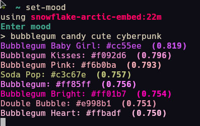

Scripts I made to experiment with current technology and my WiZ light bulb

# environmental-lighting

- [x] environmental lighting based on album art of the music playing right now
- [x] fetch script to show currently playing music in terminal
- [x] credentials and mode setting and brightness in .env file
- [x] mode 1: killswitch when next album starts
- [x] mode 2: dynamically update light color to new album as more music plays
- [x] master script appropriately named "set-stage" saved in $PATH that sets the colors to my room based on current album's album art

# smart-color-selector

- [x] set color based on prompt (achieved on may 27 2026)
- [x] find colors. thanks to [color names](https://github.com/meodai/color-names) by meodai
- [x] embedding all 31k colors (as of may 27 2026) using [all minilm](https://ollama.com/library/all-minilm) and script with ETA
- [x] generate tags for all colors using [qwen3.5:0.8b](https://ollama.com/library/qwen3.5). It took 6 hours to generate the tags.... (Well worth it)
- [x] tested various embedding models and finalized -> snowflake-arctic-embed:22m
- [ ] parallelize the generation of embeddings as embedding models are tiny
- [ ] use tiny llm to even generate the prompts as well and keep cycling color schemes every 1 hour or so

| Model | Speed | Quality | Notes |
|---|---|---|---|
| qwen3.5:0.8b | medium | Best overall | Good creativity |
| qwen3:4b | slowest | Straight up bad | "aktually 🤓" and harder to follow rules |
| qwen3:1.7b | fast | Cinematic | Very good but always "soft glow" "ethereal" "muted tones"|
| qwen3:0.6b | fast | Repetitive | Same as 1.7b but obsessed with "ethereal"|
| qwen2.5:0.5b | fastest | Alright | Very basic model, just sticks to catchphrases like "ethereal"|

| Threads | out |
|---|---|
| 1 | Embedding colors and tags ━╺━━━━━━━━━━━━━━━━━━━━━━━━━━━━━━━━━━━━━━   3% 0:08:55 |
| 4 | Embedding colors and tags ━╺━━━━━━━━━━━━━━━━━━━━━━━━━━━━━━━━━━━━━━   3% 0:14:09 |

Turns out parallelizing made it slower, I ran 4 instances of ollama, only to get a higher ETA

| Model | Speed (generating 31k embeddings) | Quality | Notes |
|---|---|---|---|
| granite:33m | 00:16:03 | too corpo | i would use rapidfuzz instead, like a caveman |
| all-minilm:22m | 00:09:52 | excellent | it's better than 33m model, but it lacks "soul"|
| all-minilm:33m | 00:11:13 | good | no soul + a bit corpo |
| snowflake-arctic-embed:22m | 00:08:07 | excellent | perfect model for this use case |
| snowflake-arctic-embed:33m | 00:09:36 | good | loses character compared to smaller model |
| nomic embed, etc | 1-2 hours | bad | not really good for this use case |

