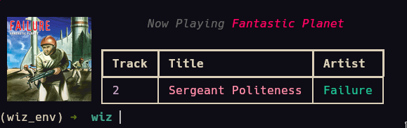

# environmental-lighting

- [x] environmental lighting based on album art of the music playing right now
- [x] fetch script to show currently playing music in terminal
- [x] credentials in .env file
- [x] killswitch when next album starts

